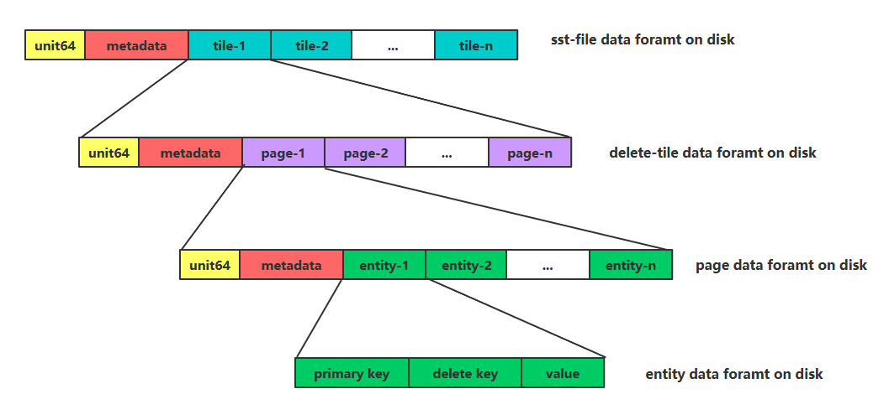

# lethe Document

## 1. LSM Engine

### 1.1 Overview: LevelDB as an example

#### 1.1.1 Architecture of LevelDB


#### 1.1.2 Put


#### 1.1.3 Get


#### 1.1.4 Compaction


### 1.2 Compaction Styles:  Leveling and Tiering

- Run: **a collection of SST FIle** with **non-overlapping** key ranges.

- Leveling: In leveling, each level may have **at most one run**.
  - More frequent  compaction
  - Less searching, less read amplification
  - Delete Persistence Latency is Longer 

- Tiering: With tiering, every level must **accumulate $T$ runs** before they are sort-merged.  
  - Less compaction
  - More read amplification
  - Delete Persistence Latency is Shorter


### 1.3 Deletes is a second-class citizen  

- Delete is a **logic delete** inserting a tombstone that invalidates older instances of the deleted key.   (Out-of-place Deletes).
- State-of-the-art LSM engines **do not provide guarantees** as to how fast a tombstone will propagate to persist the deletion.   
- Secondary Range Delete is expensive. LSM engines **only support deletion on the sort key**. To delete on another attribute such as **timestamp**, the entire tree is read and re-written.  
- Disadvantages:
  - space amplification
  - read cost
  - write amplification
  - privacy consideration ( delete persistence latency )


---------

## 2. Lethe

### 2.1 Secondary Range Deletes is important

- Views from Front line Engineers: Applications delete data daily.

  


- Periodic Deletes on Timestamp

  *"In our interactions with engineers working on LSM-based production systems, we learned **that periodic deletes of a large fraction of data based on timestamp are very frequent**."*

  

- In SOTA, **Secondary Range Deletes leads to full tree compaction.**

  

- Views from Front line Engineers: Secondary Range Deletes hurts performance

  


- In SOTA, **limiting delete persistence latency leads to full tree compaction as well.**

  In order to add a hard limit on delete persistence latency, current designs employ a costly full tree compaction as well.  


### 2.2 Full tree compaction is expensive

- Full tree compaction causes an excessive number of **wasteful I/Os** while reading, merging, and re-writing the sorted files of the entire tree. 
- Full tree compaction causes **high latency spikes**, and **increases write amplification**.


### 2.3 Solution: Lethe

**Lethe: fast persistent deletion without affecting read performance.**

- add some meta data
  - a set of new delete-aware compaction policy
  - a new physics data layout
- performance
  - **higher read throughput**
  - lower space amplification
  - **a modest increase in write amplification**


**Lethe introduces two new LSM design component: FADE and KiWi .**


-------

### 2.4 FADE

#### 2.4.1 Time-To-Live of Levels


#### 2.4.2 Compaction Policy

##### 2.4.2.1 SO


##### 2.4.2.2 SD


##### 2.4.2.3 DD


-------------

### 2.5 KiWi

#### 2.5.1 Key Weaving Storage Layout  


#### 2.5.2 Secondary Range Deletes  on KiWi


------

## 3. Reproduction

### 3.1 Some Explanations

#### 3.1.1  Implementation with Go

We reproduces Lethe with [Go](https://golang.google.cn/) rather than C++ for these reasons:

- This reproduction is a one-off  toy project without further maintenance and ambitious goals.
- Go has a higher development efficiency than C++.
- Go is easy to compile, build, run and test while C++ project is difficult to configure.
- Go has a good concurrency support.


#### 3.1.2 API Design

The design of Lethe actually breaks the abstraction of Key-Value. More specifically, it changes the API of Key-Value storage.

Traditionally, LSM Engine designs `Put` method like below: 

```
status = lsm.Put(key, value, writeOptions)
```

In Lethe, it changes as: 

```
status = lethe.Put(key, value, deleteKey, writeOptions)
```

The underlying design of Lethe changed the semantics of the API by introducing the difference between primary key and delete key. This change in API enhances  advantage in scenarios where many deletes and secondary range deletion is required, but makes Lethe unsuitable for more general scenarios.  It's a trade-off. 


### 3.2 Parallelization Design

#### 3.2.1 Lehte Main goroutine


#### 3.2.2 Compaction goroutine


#### 3.2.3 Persistece goroutine


### 3.3 SST File Format

 


### 3.4 Code Overview

#### 3.4.1 Code Dependences


#### 3.4.2 GitHub

- code

  https://github.com/Oscillator-Phoenix/lethe

- doc

  https://github.com/Oscillator-Phoenix/lethe/blob/master/doc/doc.md


---

## 4. References
