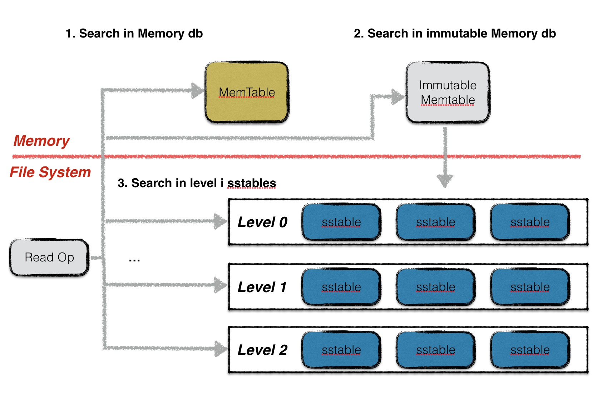
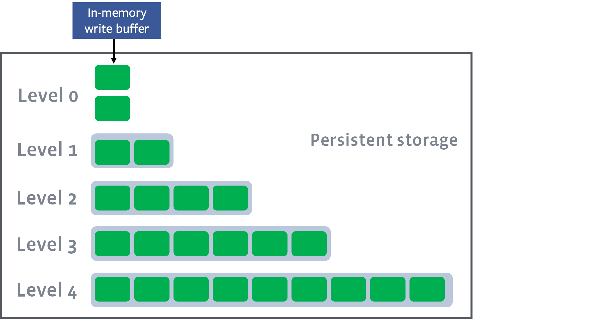

# lethe Document

## 1. LSM Engine

### 1.1 Overview: LevelDB as an example

#### 1.1.1 Architecture of LevelDB


#### 1.1.2 Put( Key, Value )


#### 1.1.3 Get( Key )




#### 1.1.4 Compaction


### 1.2 Compaction Styles:  Leveling and Tiering

- Run: **a collection of SST FIle** with **non-overlapping** key ranges.

- Leveling: In leveling, each level may have **at most one run**.
  - More frequent  compaction
  - Less searching, less read amplification
  - Delete Persistence Latency is Longer 

- Tiering: With tiering, every level must **accumulate $T$ runs** before they are sort-merged.  
  - Less compaction
  - More read amplification
  - Delete Persistence Latency is Shorter


### 1.3 Deletes is a second-class citizen  

- Delete is a **logic delete** inserting a tombstone that invalidates older instances of the deleted key.   (Out-of-place Deletes).

- State-of-the-art LSM engines **do not provide guarantees** as to how fast a tombstone will propagate to persist the deletion.   

- Secondary Range Delete is expensive. 

  We refer to deletes based on an attribute other than the sort key as secondary deletes.   

  LSM engines **only support deletion on the sort key**. 

  To delete on another attribute such as **timestamp**, the entire tree is read and re-written.  

- Disadvantages:

  - Space Amplification
  - Read Cost
  - Write Amplification
  - Privacy Consideration ( Delete Persistence Latency )


---------

## 2. Lethe

### 2.1 Secondary Range Deletes is important

- Views from front line Engineers: Applications delete data daily.

  


- Periodic Deletes on Timestamp

  *"In our interactions with engineers working on LSM-based production systems, we learned **that periodic deletes of a large fraction of data based on timestamp are very frequent**."*


- In SOTA, **Secondary Range Deletes leads to full tree compaction.**

  

- Views from front line Engineers: Secondary Range Deletes hurts performance

  


- In SOTA, **limiting delete persistence latency leads to full tree compaction as well.**

  In order to add a hard limit on delete persistence latency, current designs employ a costly full tree compaction as well.  


### 2.2 Full tree compaction is expensive

- Full tree compaction causes an excessive number of **wasteful I/Os** while reading, merging, and re-writing the sorted files of the entire tree. 
- During full tree compaction, **all reads and writes to the data store are stalled**, which causes **high latency spikes**, and **increases write amplification**.


### 2.3 Solution: Lethe

- Design Goals

  Lethe aims:

  - to **provide persistence guarantees** for point and range deletes ( achieved by **FADE** )
  - to enable practical **secondary range deletes** ( achieve  by **KiWi** )

- Performance Impact

  **Lethe: fast persistent deletion without affecting read performance.**

  - add some meta data
    - a set of new delete-aware compaction policy
    - a new physics data layout
  - performance
    - **higher read throughput**
    - lower space amplification
    - **a modest increase in write amplification**


**Lethe introduces two new LSM design component: FADE and KiWi .**


-------

### 2.4 FADE

> FADE (**Fa**st **De**letion)  

#### 2.4.1 Time-To-Live of Levels

##### 2.4.1.1 Assumption

For an LSM-tree with $L$ levels, we assume that 

- its first level (Level $0$) is an **in-memory buffer**
- the remaining levels (Level $1$ to $L - 1$) are **disk-resident**.





##### 2.4.1.2 TTL

- All tombstones are persisted within a **delete persistence threshold** ( $D_{th}$ ) which is specified by  user.

- To ensure that all delete operations issued on an LSM-tree are persisted before $D_{th}$,  

  FADE assigns a smaller TTL(Time-To-Live) for every file in  every level $d_i$.

$$
\sum_{i = 0}^{L-1} d_i = D_{th}
$$

- Both the TTL and the capacity per level increase exponentially for larger levels of the tree.

$$
d_i = T \cdot d_{i-1}
$$

​		where $T$ is the level size ratio.


##### 2.4.1.3 Meta Data of FADE

- Tombstones for point deletes are stored along with valid key-value pairs, and range tombstones are stored in a separate block.  

- FADE requires the values of **two metrics per file**:  

  - $a^{max}$

    the **age** of the oldest tombstone contained  

  - $b$ 

    the estimated **invalidation count** of the file tombstones 
    $$
    b_f = p_f + rd_f
    $$

    - $p_f$ 

      the exact **count of point tombstones** in the file

    - $rd_f$ 

      an estimation of the **entries** of the entire database **invalidated by the range tombstones of the file**  


#### 2.4.2 Compaction Policy

For every compaction, there are two policies to be decided: 

- compaction trigger policy
- file selection policy


##### 2.4.2.1 Compaction Trigger Policy

- saturation-driven trigger 

  trigger compaction when **a level is saturated** (larger than a nominal size threshold)  

- delete-driven trigger

  trigger compaction when a level that has at least **one file with expired TTL**   


##### 2.4.2.2. File Selection  Policy

- SO, **s**aturation-driven trigger and **o**verlap-driven file selection

  - **pick a file with the smallest overlap** with the subsequent level to minimize the merging cost

  - a tie in SO in broken by picking the file with the most tombstones  

- SD, **s**aturation-driven trigger and **d**elete driven file selection

  - **selects the file with the highest b**  
  - a tie in SD is broken by picking the file that contains the oldest tombstone  

- DD, **d**elete-driven trigger and **d**elete-driven file selection

  - **selects a file with an expired tombstone** 
  - a tie in DD is broken by picking the file that contains the oldest tombstone  


In addition,

- a tie in levels is broken  by picking the **smallest level**
- a tie among files of the same level, FADE chooses the **file with the most tombstones**  


-------------

### 2.5 KiWi

> KiWi **(Key Wea**ving Storage Layout)  

#### 2.5.1 Key Weaving Storage Layout  


- files in a level are sorted on $S$
- **delete tiles** within a file are sorted on $S$
- **pages with a delete tile are sorted on $D$**
- entries within every page are sorted on $D$


#### 2.5.2 Secondary Range Deletes  on KiWi

Within a delete tile, the disk pages are sorted on the delete key.  

The benefit of this approach is that these **pages can be dropped without having to be read and updated.**  

- full page drop 

  Pages are just removed from the otherwise immutable file and released to be reclaimed by the underlying file system.   

- partial page drops  

  Pages containing entries at **the edge of the delete range**, might also contain some valid entries. 

  These pages are loaded and the valid entries are identified with **a tight for-loo**p on $D$ (since they are sorted on $S$).  


**( Following this design, a page pool is required. )**


#### 2.5.3 Tunable

- Delete Tile Granularity

  The basic tuning knob of KiWi is **the number of pages per delete tile** ($h$), which affects the granularity of delete ranges that
  can be supported.  


### 2.6 Evaluation


------

## 3. Reproduction

### 3.1 Some Explanations

#### 3.1.1  Implementation with Go

We reproduces Lethe with [Go](https://golang.google.cn/) rather than C++ for these reasons:

- This reproduction is a one-off  toy project without further maintenance and ambitious goals.
- Go has a higher development efficiency than C++.
- Go is easy to compile, build, run and test while C++ project is difficult to configure.
- Go has a good concurrency support.


#### 3.1.2 API Design

The design of Lethe actually breaks the abstraction of Key-Value. More specifically, it changes the API of Key-Value storage.

Traditionally, LSM Engine designs `Put` method like below: 

```go
status = lsm.Put(key, value, writeOptions)
```

In Lethe, it changes as: 

```go
status = lethe.Put(key, value, deleteKey, writeOptions)
```

The underlying design of Lethe changed the semantics of the API by introducing the difference between primary key and delete key. This change in API enhances  advantage in scenarios where many deletes and secondary range deletion is required, but makes Lethe unsuitable for more general scenarios.  It's a trade-off. 


### 3.2 Parallelization Design


### 3.3 Data Format Design

#### 3.3.1 Internal Key Format


#### 3.3.2 SST File Format

 


### 3.4 Code Overview

#### 3.4.1 Code Dependences


#### 3.4.2 Open Source on GitHub

- code

  https://github.com/Oscillator-Phoenix/lethe

- doc

  https://github.com/Oscillator-Phoenix/lethe/blob/master/doc/doc.md


---

## 4. References

- [Lethe: A Tunable Delete-Aware LSM Engine](https://dl.acm.org/doi/10.1145/3318464.3389757) SIGMOD'20
- [Dostoevsky: Better Space-Time Trade-Offs for LSM-Tree Based Key-Value Stores via Adaptive Removal of Superfluous Merging](https://dl.acm.org/doi/10.1145/3183713.3196927) SIGMOD'18

- LevelDB

  - https://www.bookstack.cn/books/Leveldb-handbook

  - https://github.com/google/leveldb

  - https://github.com/google/leveldb/blob/master/doc/index.md#reads-and-writes
- RocksDB
  - https://github.com/facebook/rocksdb/wiki/Leveled-Compaction
  - https://www.bookstack.cn/read/rocksdb-en/573fb63dc4216007.md


---------------------

*As a course report on Advanced Database Systems Fall 2020, this document is written by kitchen in SYSU on 20201222.*

